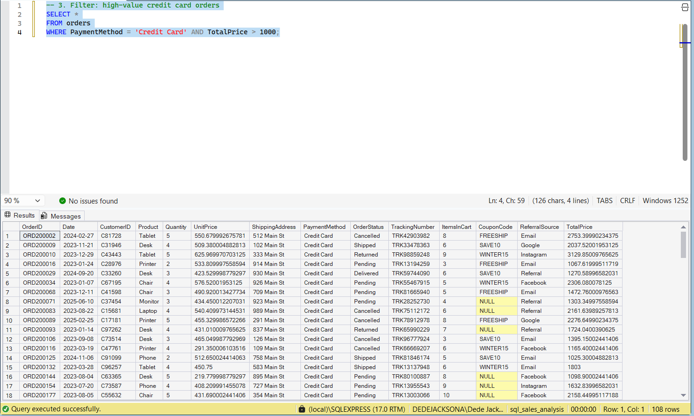
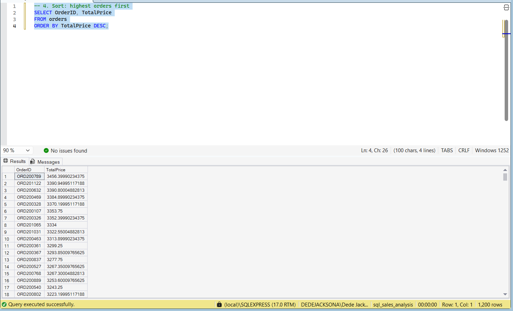
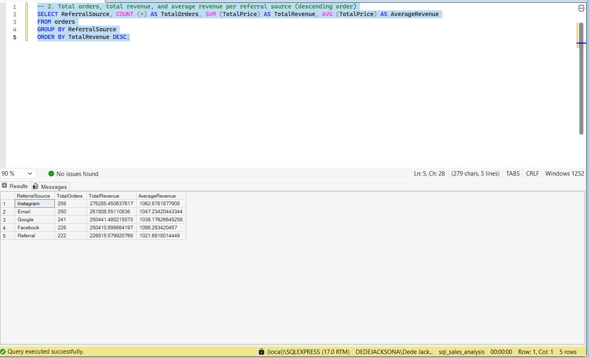

# SQL Sales Analysis — Data Analytics internship project at DecodeLabs

## What is this project
This is a Decodelabs Internship SQL project where I was assigned to write SQL queries on a real sales dataset of 1,200 orders to extract insights. I used SQL Server (via SSMS) to answer simple business questions, such as which referral source brings in the most revenue and which orders are high-value.

## Where did the data come from?
The dataset (`data/orders.csv`) contains 1,200 sales orders with columns including OrderID, Date, CustomerID, Product, Quantity, UnitPrice, PaymentMethod, OrderStatus, ReferralSource, and TotalPrice.

## Tools used
- Microsoft SQL Server (SQL Server Express)
- SQL Server Management Studio (SSMS)
- VS Code (for organizing query files)

## Related Projects
- [SQL Sales Analysis](https://github.com/dedejacksona/sales-data-cleaning-decodelabs) — SQL queries on the same underlying dataset
- [SQL Sales Analysis](https://github.com/dedejacksona/sales-data-eda-decodelabs) — SQL queries on the same underlying dataset
- [SQL Sales Analysis](https://github.com/dedejacksona/sales-data-visualization-decodelabs) — SQL queries on the same underlying dataset

## Project structure

```
sql-sales-analysis/
- data/orders.csv
- queries/01_basic_queries.sql
- queries/02_aggregations.sql
- screenshots/
- README.md
```

## Skills practiced
- Writing `SELECT` queries to choose specific columns
- Filtering rows with `WHERE`, including combined conditions using `AND`
- Sorting results with `ORDER BY` (ascending and descending)
- Grouping data with `GROUP BY`
- Aggregating data with `COUNT`, `SUM`, and `AVG`

## Example finding
Grouping orders by `ReferralSource` and calculating total and average revenue shows which marketing channel brings in the most money — useful for deciding where a business should focus its marketing spend.

## How to run these queries yourself
1. Install SQL Server Express and SQL Server Management Studio (SSMS).
2. Create a database and import `orders.csv` into a table called `orders`.
3. Open any `.sql` file from the `queries` folder in SSMS and run the queries.

## Screenshots

### High-value credit card orders


### Orders sorted by total price (descending)


### Revenue per referral source

